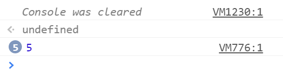

# Global var

### Problem

Suppose you have a web page that contains a `button` with the id `click-me`.

```
var button = document.getElementById('click-me');

for (var i = 0; i < 5; i += 1) {
  button.addEventListener('click', function() {
    console.log(i);
  })
}
```

1. What happens when you click the button? There are two pieces of behavior to explain—be sure you touch on both of them.

2. Explain why the button behaves this way.

### Notes to the Interviewer

This question tests the same concept as the basic [global var](../global_var) problem, but adds the complexity of multiple event listeners on the button.

Your candidate is allowed to execute this code _after_ explaining what they think will happen, but _not_ before.

### Prompts from the Interviewer

The interviewer may use these prompts to prompt additional problem-solving from the interviewee. It is not mandatory to raise every prompt.

* **Prompt/Hint**: What do the numbers next to the log statement indicate?

  * **Ask If** Ask this question if the student's console appears as in the image below.



_The console condenses messages that have been logged multiple times._

* **Look For**

  * **Candidate Explains Console Output**.

    * Candidates should explain that the numbers indicate how many time the log message was printed.

* **Note** As this is as much of a hint as a nudge in the right direction, it is acceptable if candidates do not know what the numbers represent. In this case, simply give them the answer as a free hint.

* **Prompt**: How many times is the log message getting printed? Why that many times specifically?

  * **Look For**

    * **Candidate Identifies Loop Value & Multiple Listeners**

      * Candidates should see that the message is printed the same number of times we execute the block within the `for` loop.

      * Strong candidates will immediately deduce that the button has five separate handlers attached to it, each of which does the same thing—log the value of `i`.

* **Prompt**: What would you expect each handler to log? Why does each handler log the value that it does?

  * **Look For**:

    * **Candidates Explain Global var**

      * Many people would expect each handler to print the value of that `i` contained during the iteration in which the handler was attached.

        * In other words, many would expect the handler attached when `i = 3` to print `3`.

      * Strong candidates will explain that, in fact, each handler looks up the value of `i` whenever it is called.

        * Because `var i` creates a _global_ variable that exists after the loop terminates, each handler will print a number instead of `undefined`.

        * Since `i` contains the value it had on the last iteration of the loop—in this case, 5—that is what each handler will log.

        * This is why the console reports that `5` was logged `5` times.

- - -
