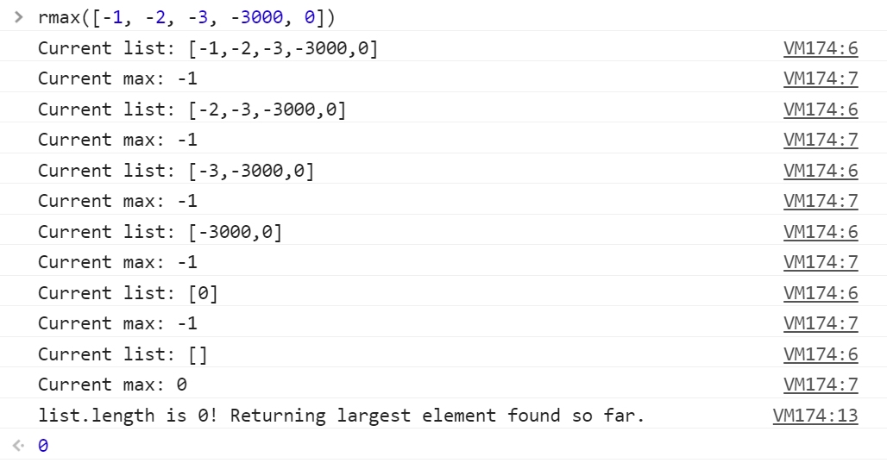

# Recursive Max Element

### Problem

Write a recursive function that finds the maximum element in a list.

### Notes to the Interviewer

Recursion is a tricky topic, so encourage candidates to take as much time as they need to sketch their solutions and think the problem through.

In particular, encourage them to _draw out_ what happens when the function runs on a small sample input, and to _draw_ or _explain out loud_ what happens when the function call itself.

### Prompts from the Interviewer

* **Prompt**: How do we find the maximum of an array using a `for` loop? How could we express that same logic with a recursive call? Don't write code—just explain what's going on in plain English.

  * **Look For**

    * **Candidate Thinks Out Loud**

      * Candidates will explain that a recursive function has to check if an element is bigger than anything we've seen so far; record it as the maximum, if so; and then run the same check on the **rest** of the array.

        * The key word really is **rest**. Check the [solution](Solved/rmax.js) for details.

* **Prompt**: How can we keep track of the biggest element we've seen so far?


```
* **Follow-Up**: Can we pass it as an argument to the function?

    * **Ask If**: Ask if your candidate can answer the previous prompt, but isn't sure how to save the best max seen so far.

* **Ask During**: Restate the Problem, Solution Sketch

* **Look For**

   * **Candidate Explains Solution**

      * Candidates should be able to explain that we have to pass the best max we've seen so far as an argument to the recursive function.
```

* **Prompt**: When do we stop the recursion?

  * **Ask During**: Solution Sketch

  * **Look For**:

    * **Candidate Explains Solution**

      * Candidates should explain that we should return the largest element we've found when the length of the list we pass to the recursive function is 0.

### Notes

With recursive functions in particular, you should encourage your candidate to _write out_ what the function does on each iteration. The image below is `console.log` output from a correct implementation.



_The rmax function at work._

Encourage your candidate to write something like this out by hand as they solve the problem for themselves.

### Solution

The solution is available in [rmax.js](Solved/rmax.js).
